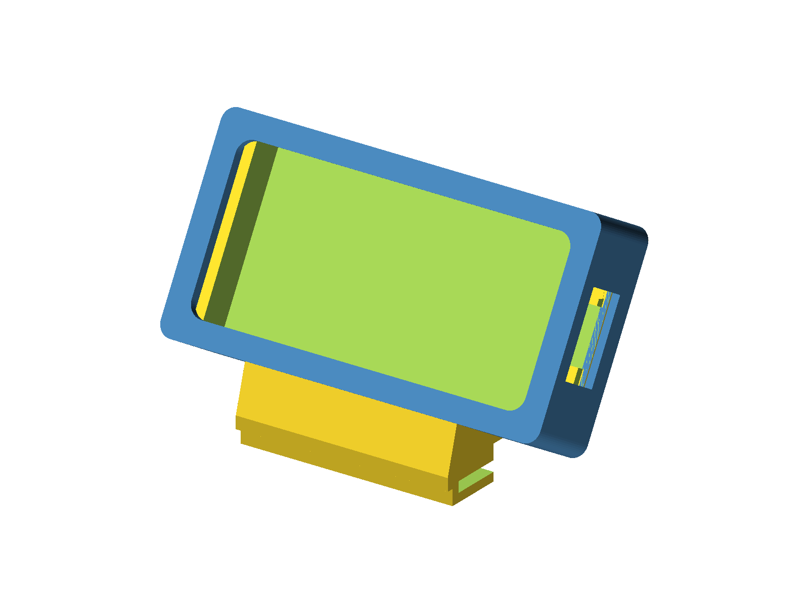

# gnat case — LilyGO T-Display S3 AMOLED (touch)

A 3D printable case for gnat running on the LilyGO T-Display S3 AMOLED
touch board, with a foot that clamps onto the DE1's horizontal frame lip.



## Parts

| file | part | notes |
| --- | --- | --- |
| `stl/tray.stl` | bottom | the board drops in, chips and molex plugs rest on the case itself |
| `stl/face.stl` | top | snaps over the tray, glass sits flush in the window |
| `stl/foot.stl` | foot, 30° | standard viewing angle |
| `stl/foot45.stl` | foot, 45° | laid back, easier viewing from above |
| `stl/plug.stl` | filler | fills the unused dovetail channel, coin slot to remove |

`model.3MF` is a slicer project with the parts already arranged.

Print one foot or the other — both use the same dovetail, so you can swap
later.

## Printing

Every STL is already in its printing orientation:

- **tray** — back down, no supports (the dovetail channels bridge)
- **face** — front down, no supports
- **foot** — on its side, needs a little support at the dovetail rail's
  two width ends; paint-on supports just there beat global auto supports
- **plug** — wide face down, no supports

A 0.4mm nozzle and 0.2mm layers are what the fits were tuned against.

## Assembly

1. Drop the board into the tray, USB port toward the end wall cutout. It
   rests level on the tall chips (non-USB end) and the pads under the
   molex plugs (USB end) — nothing is clamped.
2. Snap the face on. The skirt forms the case sides and the ridges click
   into the tray's grooves; the glass ends up flush with the face.
3. Slide the foot's rail into the dovetail channel on the case back. The
   channel opens at the bottom edge so gravity seats it, and the case
   bottom edge rests on the foot's shelf.
4. Slide the plug into the other channel, slot end out. To remove it,
   hook a coin in the end slot and drag it out.
5. Clip the foot onto the DE1's frame lip — it slides straight on.

To flip the display 180° (usb on the left), mount the case on the foot
the other way up — there is a channel opening at both edges — and flip
the orientation in gnat's settings.

## Rebuilding the STLs

Everything is generated from `model.scad` (OpenSCAD). To regenerate all
parts:

```sh
./build.sh
```

Or one part at a time with `-D 'layout="tray"'` (`tray`, `face`, `foot`,
`foot45`, `plug`, `print`, `assembly`).

Dimensions were measured off the actual board with calipers and the fits
validated with test prints; the interesting tunables (clearances, lip
thickness, tilt angles, snap depth) are all named parameters at the top
of the scad file.
