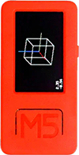
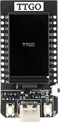
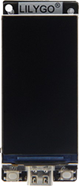

# Supported Platforms

## M5StickC Plus

The M5Stick C Plus is a fully integrated thumb-top computer. It includes a 1.14 inch screen, an ESP32-Pico-D4
chipset with Wifi and BLE and an integrated 120mh battery.

It is the easiest plug and play solution for use with GNAT and your DE1.

[Purchase from Amazon](https://www.amazon.com/M5StickC-Plus-ESP32-PICO-Mini-Development/dp/B08VGST8LJ/)

[Purchase from M5Stack](https://shop.m5stack.com/products/m5stickc-plus-esp32-pico-mini-iot-development-kit)

 

## TTGO T-Display

The TTGO T-Display is an ESP32 based development board that has an integrated 1.14 inch screen and battery charger. It also supports Wifi and BLE but does not come with a case or battery like the M5Stick.

This is a fine choice if you want to print your own case and supply your own battery for use with GNAT.

[Purchase from Amazon](https://www.amazon.com/LILYGO-T-Display-Arduino-Development-CH9102F/dp/B099MPFJ9M)

 

## TTGO-S3 T-Display

The TTGO T-Display S3 is the younger, more handsome brother to the TTGO above. It features an updated ESP32-S3 processor and has a much larger 1.9 inch
screen with a 320x170 resolution. It also sports 16MB of flash. Like the TTGO it is sold without a battery or case so you 
will need to provide your own or provide constant power.

The much larger display makes this the nicest option for running GNAT currently and is where most of the development is focusing but you will need to get a case at the very least and a battery as well if you don't want to provide separate power.

[Purchase from Amazon](https://www.amazon.com/LILYGO-T-Display-S3-ESP32-S3-Display-Development/dp/B0B7X5RVTH/)

 

# GNAT Releases

GNAT development takes place on [Github](https://github.com/nicpottier/gnat) and new releases are bundled and are available to install here. You will just need a cable and a Chrome browser to flash your device.

<table>

<tr>
  <th style="text-align:right;">Version</th>
  <th>M5StickC</th>
  <th>TTGO</th>
  <th>TTGO-S3</th>
</tr>    



<tr>
  <td style="text-align:right;">{{ release.name }}</td>

  <td style="text-align:center;">
    
    
<esp-web-install-button manifest="assets/firmwares/{{release.version}}/gnat_{{platform}}_{{release.version}}.json">
<button type="button" class="btn btn-blue" slot="activate">INSTALL</button></esp-web-install-button>
    
    
  </td>

  <td style="text-align:center;">    
    
    
<esp-web-install-button manifest="assets/firmwares/{{release.version}}/gnat_{{platform}}_{{release.version}}.json">
<button type="button" class="btn btn-blue" slot="activate">INSTALL</button></esp-web-install-button>
    
    
  </td>

  <!-- <td style="text-align:center;">    
    
    
<esp-web-install-button manifest="assets/firmwares/{{release.version}}/gnat_{{platform}}_{{release.version}}.json">
<button type="button" class="btn btn-blue" slot="activate">INSTALL</button></esp-web-install-button>
    
    
  </td>
  -->  

</tr>



</table>